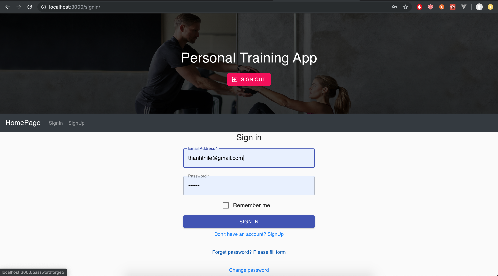
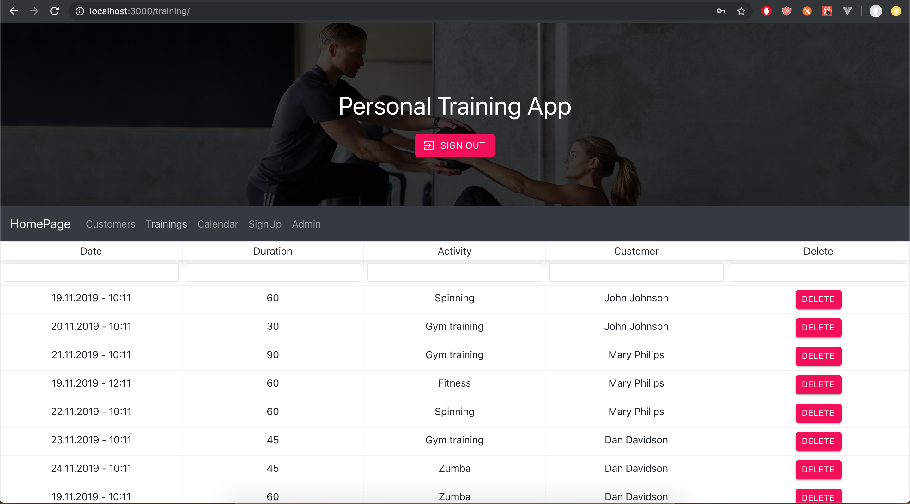

<Personal_Training_Database_App>
=====================

An app to fetch data from backend to show on frontend by React.
Authentication by Firebase.

Running Tests
-------------

### React
In the app directory, use: 
npm start
.The app will run on http://localhost:3000

__Demonstration__

